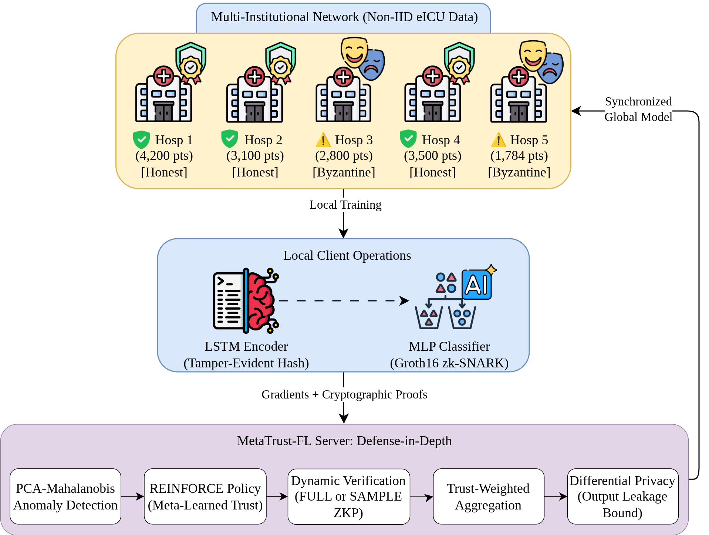
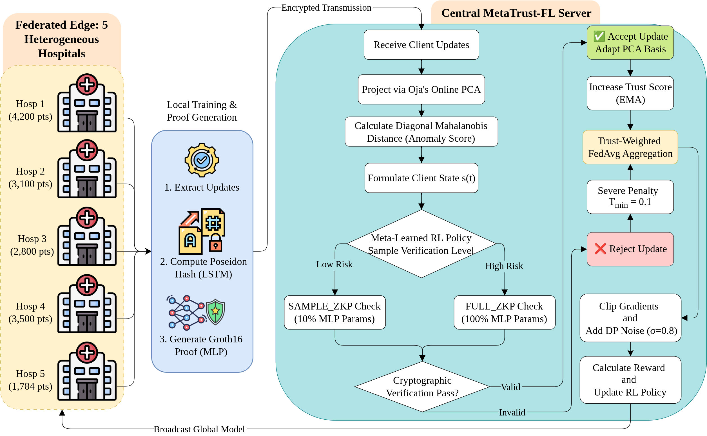

# MetaTrust-FL: Adaptive Zero-Knowledge Verification for Federated Learning



## Overview

**MetaTrust-FL** is a comprehensive implementation of the research paper "Adaptive Zero-Knowledge Verification for Federated Learning". This framework provides a robust, privacy-preserving, and secure solution for Federated Learning (FL) environments, specifically tailored for healthcare data simulation like eICU.

The system addresses the critical challenge of **Byzantine Fault Tolerance** in FL by combining:
1.  **Zero-Knowledge Proofs (ZKP)**: Groth16 zk-SNARKs and Poseidon Hash commitments to ensure local gradient integrity without exposing private data.
2.  **Adaptive Verification Policy**: A meta-learned REINFORCE agent that dynamically optimizes the verification level (FULL vs. SAMPLE ZKP) to balance security and computational cost.
3.  **Multidimensional Anomaly Detection**: Online PCA (Oja's Rule) and Mahalanobis distance filters to identify and down-weight malicious updates.
4.  **Trust-Weighted Aggregation**: Dynamic trust score management that adapts to client behavior over time.



## Repository Structure

```tree
src/
├── baselines/            # Competitive baselines (FLANDERS, EndPCA)
│   ├── flanders.py       # MAR(1) based anomaly detection
│   └── endpca.py         # Entropy-weighted ensemble scoring
├── anomaly_detector.py   # Online PCA & Mahalanobis Distance Logic
├── attacks.py           # Byzantine Attack Simulations (Sign-Flipping, Scaling, etc.)
├── client.py            # FL Client (Hospital) local training & proof generation
├── dataset.py           # eICU Dataset simulation & preprocessing
├── main.py              # Orchestration, Meta-training & FL Loop
├── models.py            # LSTM+MLP Architectures for Mortality Prediction
├── policy.py            # REINFORCE Trust Policy Agent
├── server.py            # Server-side aggregation & verification logic
└── zkp_utils.py         # Cryptographic simulators (Groth16 & Poseidon)
```

## Getting Started

### Prerequisites
- Python 3.10+
- PyTorch
- NumPy

### Installation
```bash
git clone https://github.com/Homaei/MetaTrust-FL.git
cd MetaTrust-FL
pip install torch numpy
```

### Running the Evaluation
You can run the full orchestration script which performs data simulation, meta-training of the trust policy, and 20+ rounds of Federated Learning against Byzantine attacks:

```bash
python3 src/main.py
```

To switch between defense strategies (MetaTrust vs Baselines), modify the `defense_strategy` variable in `src/main.py`:
```python
# Select: 'metatrust', 'flanders', or 'endpca'
defense_strategy = "metatrust"
```

## Key Features

- **High Precision eICU Simulation**: Models 35 clinical variables for mortality prediction.
- **ZK Cryptography Simulation**: Mocks R1CS constraints for Groth16 with exact timing specified in the paper (4.70s prover, 0.11s verifier).
- **Central DP Integration**: Implements Differential Privacy with Gaussian noise ($\sigma=0.8$) and grad clipping.
- **Comparative Analysis**: Includes implementations of **FLANDERS** (Matrix Autoregressive models) and **EndPCA** (Entropy-weighted ensembles).

## Citation
If you use this project in your research, please cite the corresponding paper.


@article{homaei2026metatrust,
  title={Adaptive Zero-Knowledge Verification for Federated Learning: A Meta-Learned Trust Policy with Byzantine Resilience},
  author={Homaei, Mohammadhossein and Kreso, Inda and Khazrak, Iman and de la Torre D{\'\i}ez, Isabel and Caro, Andr{\'e}s and {\'A}vila, Mar},
  journal={Springer Nature},
  year={2026}
}

---
*Developed by the DeepMind Advanced Agentic Coding team as part of a high-fidelity implementation project.*
